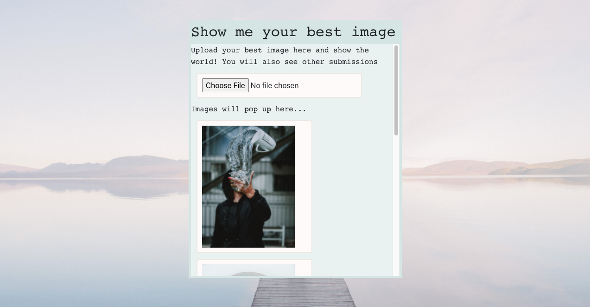
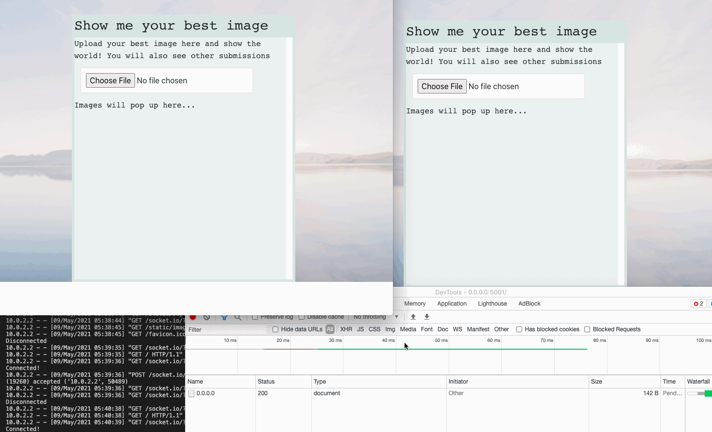
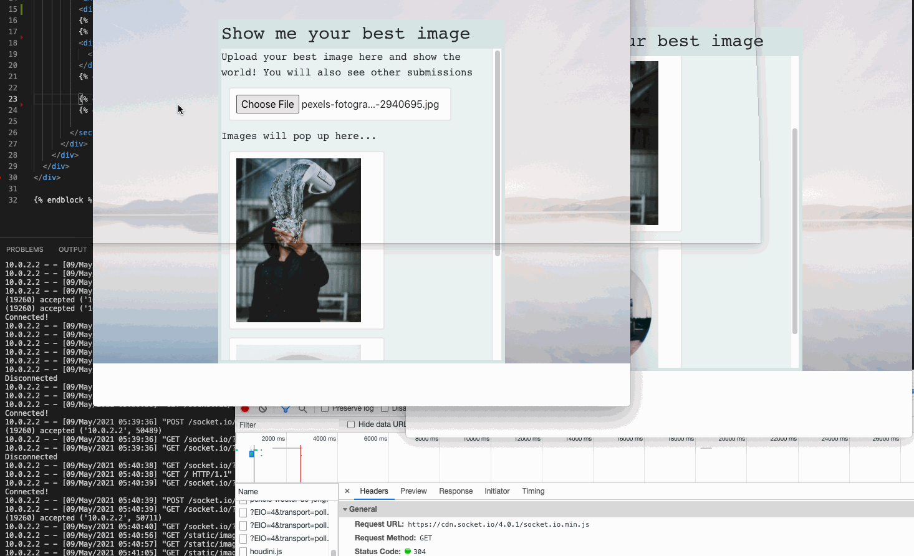

# Chat with just images!
## Table of Contents
1. [Overview](#overview)
2. [Technologies](#technologies)
3. [Installation](#installation)
4. [Roadmap](#roadmap)
5. [FAQs](#faqs)

## Overview
<a name="Overview"></a>
An cool twist to using asynchronous communication between the server and clients with just images.
It's a general chat with images as a form of talk. You know how they say an image can 
mean a thousand words? Let's test that!


## Features
***
***Any users can see the live chat and input their own image***


***
***- JQuery on input change sends the image as Base64***<br>
***- Sever then reads the data into a new renamed png file***<br>
***- Then that file route are saved into PostgreSQL DB for future queries***<br>
***- Using Jinja,server will plug in all images from DB for any new connections, keeping it so everyone see the same things***
***


## Technologies
<a name="Technologies"></a>
- Python, SQLAlchemy, PostgreSQL, Flask, FlaskSocketIO, eventlet
- Javascript, jQuery(AJAX), Jinja2, Bootstrap, HTML5, CSS3
- APIs: Socket.IO

## Installation
<a name="installation"></a>
Tip: Clone this repo
***
Next steps: 
```
$ git clone https://github.com/JeeheeHan/WebSocket-Images.git
$ pip3 install -r requirements.txt
$ createdb imagepath
$ python3 server.py
```
And enjoy!

Don't forget to run tests too
```
$ python3 tests.py
```

## Roadmap
<a name="Roadmap"></a>
Feature releases coming up:
- More styling for better UX
- Add users routes for logging in/out and manage image submissions!
- Add a popularity ratings feature taking in likes

### FAQs
<a name="faqs"></a>
Jenny was a revenue manager specializing in hospitality management which included data modeling, forecasting, and channel optimizing. As the POS expert, she got involved in a new website launch to test the direct booking integration. Through this involvement, she got inspired to transition into SWE to create cost effective infrastructure that can improve operations and system reliability with numerous distributions. From the holistic perspective of CRM and profit driving strategies, Jenny is eager to apply her coding skills to enhance such tech. Aside from programming, she is also passionate about keeping up with the latest technologies for best performance with new game launches. Find her on [LinkedIn](https://www.linkedin.com/in/jihee-jenny/) and on [Github](https://github.com/JeeheeHan).